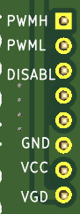

# HBD1E
Kicad project for a flexible gate driver board to drive two MOSFETs with TO-247-4 package and
pinout [Drain, Source, KelvinSource, Gate].

Front side of board:

Back side of board:

# Features

- Supports 2 independent channels with 1 MOSFET per channel.
- No high-power connections on the board.  The user is free to connect the MOSFET power pins in any configuration they wish.
- Utilizes a gate driver chip in an SOIC-16 wide package, with a pin layout supported by multiple vendors.
- Each channel can be independently configured to be isolated from the gate driver control circuit.
- Each channel can be independently configured to use a linear regulator to precisely control the gate driver voltage.
- Most compatible gate driver chips support configurable dead time.

# Applications

- Half bridge, with input and output having a common ground: Configure the high side to be isolated, and the
low side non-isolated.
- T-Type inverter leg: Use 2 boards, with all gate power domains isolated, with the two middle MOSFETs configured
appropriately for common drain or common source.
- High power parallel MOSFETs: Disable dead time on the gate driver chip, and configure both MOSFET power
domains as non-isolated.

# Board Connections

Board input pins:  

- PWMH: PWM signal for the high-side MOSFET Q1, uses typical CMOS switching levels (off <= 0.8V, on >= 2.0V).
- PWML: PWM signal for the low-side MOSFET Q2, uses typical CMOS switching levels.
- DISABL: Pull this value low to enable the driver chip.  There is a pull up resistor to VCC on this circuit,
so the control component must pull this signal low to enable switching.  Uses typical CMOS switching levels.
- GND: Ground common to VCC and VGD.
- VCC: Power to the control side of the gate driver chip.  Typically 3.3V or 5V, maximum 20V.
- VGD: Power to the gate driver regions, optionally through isolation modules.

For the reference gate driver chip UCC21520, VCC and VGD may be the same for applications with lower
gate voltages.  Or you may choose to have them be separate, and use a higher voltage VGD to gain headroom
through the isolated modules, and configure the linear regulators to provide a precise post-isolation
gate drive voltage.

Note that there are no on-board connections for the high-current drain and source pins for either
MOSFET Q1 or Q2.  These must be connected separately, either through appropriately-sized wires or
a properly-designed laminated bus.

# Schematic

# PCB Details

PCB components:

Front copper layer:

Back copper layer:

# Configuring Channel Isolation

The front of the board has marked locations for two DC-DC isolated modules, U3 (high side, shown below) and U5 (low side).

  

These modules take power from the VGD pin, and supply it to the regions of the PCB driving the gates for
the high side MOSFET Q1 and the low side MOSFET Q2.

To make either region isolated, solder a DC-DC isolated converter module in the marked location.
Our test boards used a Gaptec 3S7B-2424S3UP, but pin-compatible 7-SIP components are available from multiple manufacturers.

To make one of these power domains non-isolated, solder a wire connection from + to + and another from - to -.
Ordinary AWG 20 gauge hookup wire is adequate.

# Configuring Gate Drive Voltage Regulation

On the back side of the board, under the isolated modules U3 and U5, are locations for LM317 linear regulators
and associated components.

  

- High Side: (under U3) U4, D3, D4, C10, C11, R14, R15, R16
- Low Side: (under U5) U2, D1, D2, C7, C9, R11, R12, R13

Note that we used 2 resistors in series for the connection from the LM317 adjust pin to VSSx.
The power dissipation from the minimum regulation current may exceed the limit for a typical
1/10 watt resistor, so we use 2 resistors in series to spread the thermal load.

Note also that the LM317 is a very robust device that may not require all the configured components.
The adjust capacitors may be omitted if your testing shows that ripple and other transients do not cause any
downstream issues when switching the MOSFETs.  Each of the adjust capacitors is paired with a diode:

- C9, D2
- C11, D4

If you omit the adjust capacitor, you can also omit the matching diode.  If you use the adjust capacitor,
you should also use the diode to prevent the capacitor from discharging through the regulator in a power off
scenario.

Also note that you should always populate D1 and D3, since there are large capacitors for the gate driver
chip that may discharge through the regulator in a power off scenario.  D1 and D3 will prevent this.

To configure either the high-side or low-side power domain for voltage regulation, populate the associated
components as listed above.

To configure either of the power domains without voltage regulation, omit all of the regulation components
listed above for that domain, and replace the associated diode (D1 or D3) with a 0 ohm shunt resistor.

# Configuring Dead Time

  

Some, but not all of the pin-compatible gate driver chips support controlling dead time between Q1 and Q2
gate transitions, using a resistor connected to pin 6.  If the gate driver chip you use does not support dead
time generation, then do not populate R1, R10 and C6, and ignore the rest of this section.

If your gate driver chip supports dead time insertion, populate R10 and optionally C6 according to the
datasheet for your chip.  Do not populate R1.

If your control logic providing the PWM signals also implements dead time, one strategy is to program an
absolute minimum dead time via the hardware as described in this section, and program an optimized, longer
dead time in your control logic.  The gate driver chip uses the longer of the hardware configured dead
time or the software-controlled dead time in the PWM inputs.

If your chip supports dead time insertion, but you wish to suppress it, populate R1, but not R10 and C6.
This may be desireable if you use this board in a high-current parallel MOSFET application, as described
above.

# Reference Components

- Gate driver chip: Texas Instruments UCC21520
- MOSFET: Infineon AIMZH120R020M1TXKSA1
- Isolated DC-DC module: Gaptec 3S7B-2424S3UP
- Linear Regulator: Texas Instruments LM317

